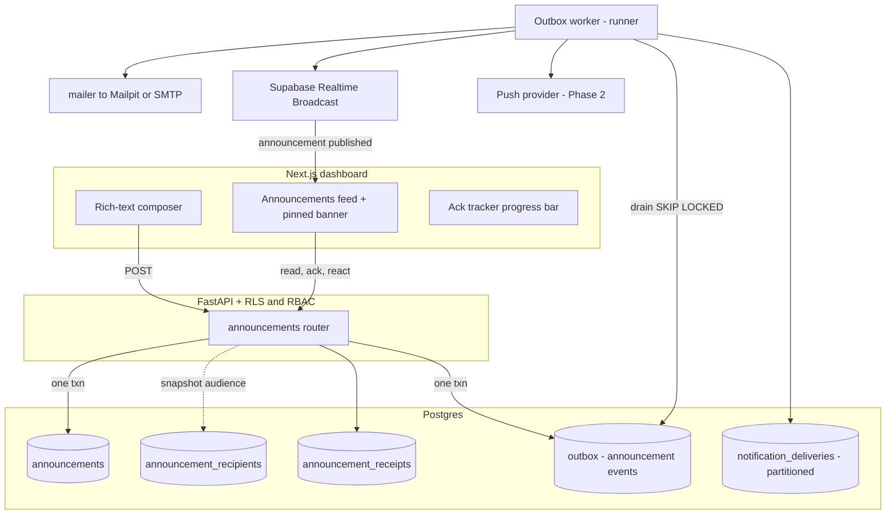
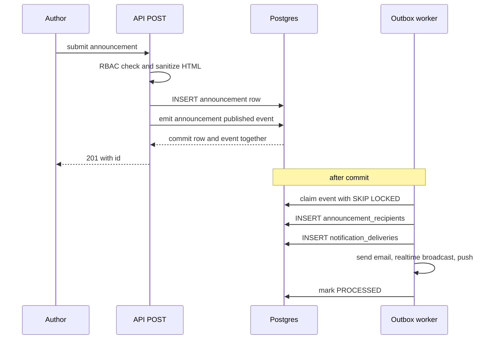

# Announcements (Headlines) — Target Architecture

Company-wide and team-level communications with read receipts, acknowledgment
tracking, reactions/comments, pinned priority posts, and multi-channel delivery
(in-app, email, push).

This document proposes the **correct** architecture and reconciles it with what
already exists in the repo. A first-cut module is already shipped
(`database/23_announcements.sql`, `backend/app/routers/announcements.py`,
`frontend/app/dashboard/announcements/page.js`); it works but takes several
shortcuts that diverge from patterns this codebase has *already built* elsewhere
(the transactional outbox, Realtime Broadcast, partitioning + pg_partman +
pg_cron, tiered RLS, the RBAC matrix). The goal here is to fold Announcements
onto those same rails.

Legend: ✅ already in repo · 🟡 shipped-but-simplified · 🔭 proposed / Phase 2.

---

## 1. Where the current implementation diverges

| # | Current (`23_announcements.sql` / `routers/announcements.py`) | Problem | Correct approach |
|---|---|---|---|
| A | Notifications fan out **synchronously inside the POST** — a loop inserts `notification_deliveries` rows and sends email in the request | Contradicts the documented outbox design (`ARCHITECTURE-GAPS.md §4`). A company-wide post to 1000s of users blocks the request, is not retryable, and partially fails | Emit **one** `announcement.published` event to the outbox in the same txn; the worker fans out deliveries, email, push, and realtime |
| B | `recipients` (the ack% denominator) is derived from `notification_deliveries` rows written at publish time | Frozen snapshot: users who join a team/tenant *after* the post are never counted; the semantics are accidental, not chosen | Make the audience snapshot **explicit** (`announcement_recipients`), and decide snapshot-vs-live per requirement (see §4) |
| C | Search is `title ILIKE '%q%' OR body ILIKE '%q%'` | Cannot use an index → full scan; fails the "searchable archive" acceptance criterion at scale | `tsvector` + GIN full-text, plus `pg_trgm` for fuzzy title match |
| D | `body` is plain `TEXT`; "rich text + media" is a stated requirement | No sanitization story, no media storage | Store sanitized HTML (server-side sanitize) + a `body_format` column; media in a Supabase Storage bucket |
| E | `notification_deliveries` and `announcement_receipts` grow unbounded and append-only | Same class of high-volume time-series table the repo just partitioned (`20_kpi_scores_partitioning.sql`) | Monthly range partition + BRIN on `created_at` via pg_partman + pg_cron |
| F | Feed does not update live | Repo already has server-authoritative Realtime Broadcast | Publish `announcement.published` to a tenant/team channel from the worker |
| G | Scheduled/future-dated posts are "Phase 2" with no seam | — | `publish_at` + a pg_cron job that flips `scheduled → published` and emits the event — infra already present |

None of these are rewrites. Each swaps a shortcut for a rail the codebase
already runs.

---

## 2. System context



**Golden rule (already the repo's rule):** the request path only writes the
domain row + the outbox event, atomically. Everything outward-facing
(deliveries, email, push, realtime) happens in the worker, *after commit*.

---

## 3. Data model

Keep the existing five tables; add a recipients snapshot, search vector,
scheduling, and rich-text/media columns.

### 3.1 `announcements` (extend)
```
+ status        TEXT   'scheduled' | 'published' | 'archived'   -- default 'published'
+ publish_at    TIMESTAMPTZ                                     -- when status='scheduled'
+ body_format   TEXT   'html' | 'markdown' | 'plain'           -- default 'html'
+ priority      TEXT   'normal' | 'high'                       -- drives banner; pinned stays boolean
+ search_tsv    TSVECTOR  GENERATED ALWAYS AS
                 (setweight(to_tsvector('english', coalesce(title,'')), 'A') ||
                  setweight(to_tsvector('english', coalesce(body,'')),  'B')) STORED
CREATE INDEX idx_ann_search ON announcements USING gin (search_tsv);
CREATE INDEX idx_ann_title_trgm ON announcements USING gin (title gin_trgm_ops);
CREATE INDEX idx_ann_feed ON announcements (tenant_id, pinned DESC, created_at DESC)
    WHERE status = 'published';
```

### 3.2 `announcement_recipients` (NEW — the explicit audience snapshot)
Resolves gap **B**. Written by the **worker** when it processes
`announcement.published`, from `_recipients()` logic promoted into SQL. This is
the single source of truth for the ack% denominator and for delivery fan-out.
```
announcement_id UUID  → announcements(id) ON DELETE CASCADE
user_id         UUID  → users(id)
tenant_id       UUID  → organizations(id)
PRIMARY KEY (announcement_id, user_id)
```
Why a table and not a live query: the ack tracker needs a stable denominator
("42 of 118 acknowledged") that does not shift as people join/leave. Late
joiners are handled by a **reconciliation** decision, not by accident (§4).

### 3.3 `announcement_receipts` (keep) — per-user `read_at` / `ack_at`, unchanged.

### 3.4 `announcement_comments`, `announcement_reactions` (keep) — unchanged.

### 3.5 `notification_deliveries` (keep + partition)
Append-only, one row per (recipient × channel). Convert to **monthly range
partitioning on `created_at` with a BRIN index**, following
`20_kpi_scores_partitioning.sql` exactly (pg_partman `create_parent` +
pg_cron `run_maintenance_proc`). Add delivery lifecycle:
```
+ status  'queued' | 'sent' | 'delivered' | 'failed' | 'bounced'   (default 'queued')
+ error   TEXT
+ sent_at TIMESTAMPTZ
```

### 3.6 Outbox (reuse, lightly generalized)
`meeting_outbox` already has `aggregate_type` and defaults it to `'meeting'`.
Two options:
- **Recommended:** rename `meeting_outbox` → `outbox` (keep a view alias for the
  meetings code) so it is a shared event log. `emit(...)` already takes
  `aggregate_type`.
- **Minimal:** reuse `meeting_outbox` as-is with `aggregate_type='announcement'`.
  Works today; the name just lies.

Events: `announcement.published`, `announcement.updated`,
`announcement.acknowledged` (optional analytics), `announcement.scheduled`.

---

## 4. The recipient/ack semantics decision (call it out)

The "correct" answer depends on the business rule — flag it for product, don't
let the code decide by omission:

- **Snapshot at publish (recommended default):** audience is frozen when the
  post goes out. "118 people were notified; 42 acknowledged." Clean, auditable,
  matches how acknowledgment/compliance reporting is usually read. → the
  `announcement_recipients` table.
- **Live membership (opt-in):** for evergreen team announcements you may want new
  members to also see and acknowledge. Handle with a lightweight pg_cron
  **reconciliation** job that inserts missing `announcement_recipients` rows for
  posts flagged `audience_mode='live'`, then emits a delivery event for the
  newcomers.

Either way the denominator comes from `announcement_recipients`, never from a
`SELECT count(*)` over whatever team membership happens to be *right now*.

---

## 5. Publish flow (request path)



- **Scheduled posts:** row saved `status='scheduled'` with `publish_at`. A
  pg_cron job (`announcements_publish_due`, every minute) flips due rows to
  `published` and calls `emit('announcement.published')`. The worker path is
  then identical to an immediate post.
- **Idempotency:** wrap create with the existing `meeting_idempotency` store
  (generalize to `idempotency`) so a retried POST doesn't double-publish.

---

## 6. Notification pipeline (worker)

`announcement.published` handler in `outbox_worker._handle`:
1. Resolve audience (`tenant` → `tenant_memberships`; `team` → `team_members`)
   → bulk `INSERT ... SELECT` into `announcement_recipients`.
2. Bulk-insert `notification_deliveries` rows: always `in_app`; `email` if the
   user has an address and hasn't opted out; `push` if a device token exists.
3. Dispatch per channel:
   - **in_app** — the row itself is the inbox item; mark `sent`.
   - **email** — `app.mailer.send_email` (Mailpit locally). Batch/throttle.
   - **push** 🔭 — provider adapter (FCM/APNs/web-push), same shape as the
     calendar-provider seam already in the worker.
4. Publish `announcement.published` envelope to Realtime so open feeds refetch.

Per-recipient failures update that delivery row's `status='failed'` + `error`;
they do **not** fail the whole event (mirrors the calendar `not_configured`
handling already in `_handle`).

---

## 7. Realtime feed

Reuse `realtime_broadcast.broadcast()`, generalizing the channel beyond
`meeting:<id>`:
- `tenant:<tenant_id>:announcements` — company-wide posts.
- `team:<team_id>:announcements` — team posts.

Client subscribes to its tenant channel (+ each team it belongs to), receives a
lightweight envelope, and refetches the RLS-guarded feed — never trusting the
broadcast as the source of truth. Same contract as the L10 meeting runner.

---

## 8. API surface

Mostly present; the deltas are the event emit, sanitization, scheduling, search,
and pagination.

| Method | Path | Notes / change |
|---|---|---|
| GET | `/announcements` | keep; swap ILIKE → `search_tsv @@ websearch_to_tsquery`; add keyset pagination (`created_at,id`) and `status`/`pinned` filters |
| POST | `/announcements` | **change**: sanitize HTML; write row + `outbox.emit`; support `publish_at`; drop the inline delivery loop |
| PATCH | `/announcements/{id}` | keep author/leadership gate; emit `announcement.updated`; allow archive |
| DELETE | `/announcements/{id}` | keep (soft-delete → `status='archived'` preferred over hard delete for the archive requirement) |
| POST | `/announcements/{id}/read` · `/ack` | keep; ack emits optional analytics event |
| POST | `/announcements/{id}/react` | keep |
| GET/POST | `/announcements/{id}/comments` | keep |
| GET | `/announcements/{id}/acks` | **change**: denominator from `announcement_recipients`, not `notification_deliveries` |
| GET | `/announcements/{id}/deliveries` 🔭 | admin delivery report (per-channel sent/failed) |

RBAC unchanged and already correct: company-wide ⇒ `require_leadership`
(`{fund_admin, lead_partner, deal_qb, portco_management}`), team ⇒
`require_permission("create")`. RLS via `user_accessible_tenants()` on every
table, exactly as `23_announcements.sql` does today.

---

## 9. Scaling & storage

- **Partition** `notification_deliveries` (and, if volume warrants,
  `announcement_receipts`) monthly on `created_at` + BRIN, per migration 20.
  These are the high-cardinality append tables; announcements/comments stay
  small btree tables.
- **Fan-out cost:** a company-wide post is O(recipients × channels) writes — do
  it as set-based `INSERT ... SELECT` in the worker, not a Python loop, and
  chunk very large tenants.
- **Media:** Supabase Storage bucket `announcement-media` (config already has
  `[storage]` enabled); store object paths in the body/HTML, serve via signed
  URLs.
- **Retention:** deliveries can carry a pg_partman retention window (e.g. drop
  delivery telemetry >18 months) — receipts/acks are compliance data, keep
  forever (retention disabled, same choice as kpi_scores).

---

## 10. Migration plan (additive, ordered) — ✅ implemented

1. ✅ `29_announcements_v2.sql` — extend `announcements` (status, publish_at,
   body_format, priority, `updated_at`, tsvector + GIN + trgm indexes, feed +
   due partial indexes); `pg_trgm` extension.
2. ✅ `30_announcement_recipients.sql` — new snapshot table + RLS + grants.
3. ✅ `31_notification_deliveries_lifecycle.sql` — additive `status` vocabulary +
   `error`/`sent_at` columns (safe, always-apply; kept separate from the
   partition step so it lands even if the conversion is deferred).
4. ✅ `32_notification_deliveries_partition.sql` — convert to monthly range
   partition + BRIN + pg_partman register + 18-month retention + pg_cron
   maintenance (clone of migration 20's guarded, one-shot pattern). **Run once
   in a maintenance window**; verify (step 7) before dropping the legacy table.
5. ✅ `33_announcements_schedule.sql` — `publish_due_announcements()` +
   pg_cron `announcements_publish_due` job (every minute).
6. 🔭 (optional) generalize `meeting_outbox` → `outbox` + compatibility view.
   Not done: the outbox is reused as-is via its `aggregate_type='announcement'`
   column (the minimal option in §3.6), which avoids churning the meetings code.
7. ✅ Backend: `sanitizer.py` (dependency-free allowlist HTML sanitizer);
   `realtime_broadcast.broadcast_to()` + announcement channel helpers;
   `outbox_worker._handle` gains an `announcement.*` branch that snapshots
   recipients, fans out in-app + email deliveries (idempotent), and broadcasts;
   `routers/announcements.py` create() is emit-only + sanitize + scheduling,
   list() uses full-text search, `/acks` counts from `announcement_recipients`,
   and a new `/deliveries` report was added.
8. ✅ Frontend: subscribes to the tenant + per-team announcement channels for
   live refetch; composer gained priority + "schedule for later"; scheduled
   posts show a badge; the post/schedule flash uses the async response shape.

Each migration is guarded/re-runnable like the existing ones; migration 32 (the
partition conversion) is the only non-hot-path, run-once-in-a-window step.

> **Note on `body_format`:** the current composer is a plain textarea and sends
> `body_format:'plain'`, so the server stores text verbatim. The sanitizer and
> `body_format:'html'` path are wired and tested for when a rich-text editor is
> dropped in — at which point the feed should render the stored HTML via
> `dangerouslySetInnerHTML` instead of as text.

---

## 11. Phasing

- **Phase 1 (now):** items 1–4, 6 — event-driven publish, snapshot recipients,
  full-text search, scheduled posts, sanitized rich text. In-app + email only.
- **Phase 2 🔭:** push (FCM/APNs/web-push adapter in the worker), SMS channel,
  live-audience reconciliation job, delivery report UI, media uploads to
  Storage, generalized shared `outbox`.

---

## 12. Summary — the one-line version

Announcements should ride the **same rails the repo already built for
Meetings**: write the post + a `announcement.published` outbox event in one
transaction, let the outbox worker own all fan-out (deliveries, email, push,
Realtime) after commit, snapshot the audience explicitly for honest ack
tracking, index the archive with Postgres full-text, and partition the
high-volume delivery table with pg_partman + BRIN. Everything needed is already
proven elsewhere in this codebase — this is composition, not new infrastructure.
