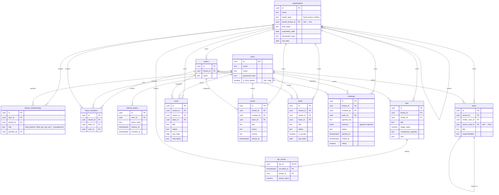

# HHCP Business Operating System — Entity-Relationship Diagram

Generated from the live PostgreSQL schema (`hhcp_demo`). Every box is a real
table; every line is a real foreign key. Multi-tenancy is enforced with
Row-Level Security keyed on `tenant_id → organizations.id` (not shown as it's a
policy, not a column relationship).

## Reading the diagram

**Three hubs everything hangs off:**
- **`organizations`** — the Fund → PortCo → Add-on tree (`parent_tenant_id` is self-referencing). Every business table carries `tenant_id → organizations.id`; RLS filters on it.
- **`users`** — deliberately has **no** tenant column. A user's access comes from `tenant_memberships` (Tier 2 grants) plus the `is_fund_admin` flag (Tier 1), which is what lets one person work across many PortCos.
- **`teams` / `team_members`** — working groups inside a tenant; Rocks / Issues / To-Dos / Meetings can be assigned to a team.

**Feature modules** (all tenant-scoped, all optionally owner/team-linked):
`kpis` + `kpi_scores` (Scorecard, append-only weekly history), `rocks`, `issues`, `todos`, `meetings` (with a JSONB agenda snapshot + timing), and `seats` (Accountability Chart, self-referencing `parent_seat_id`).

**Auth:** `refresh_tokens` backs server-side session revocation; access tokens are stateless JWTs (not stored).
