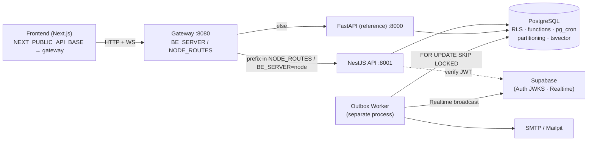
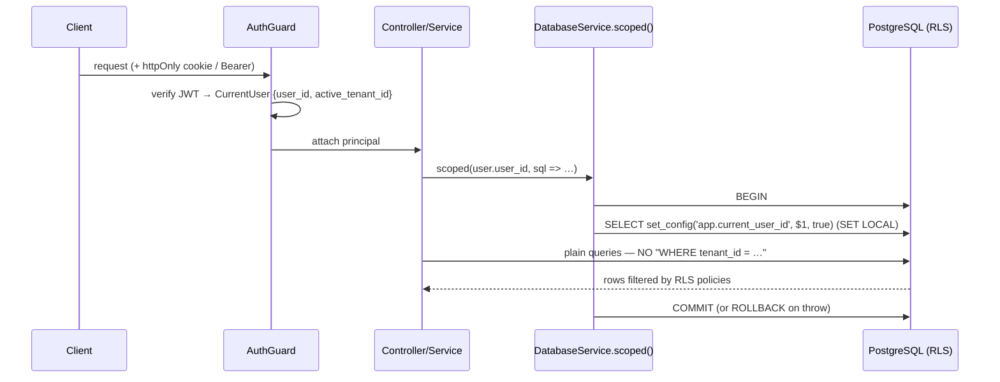
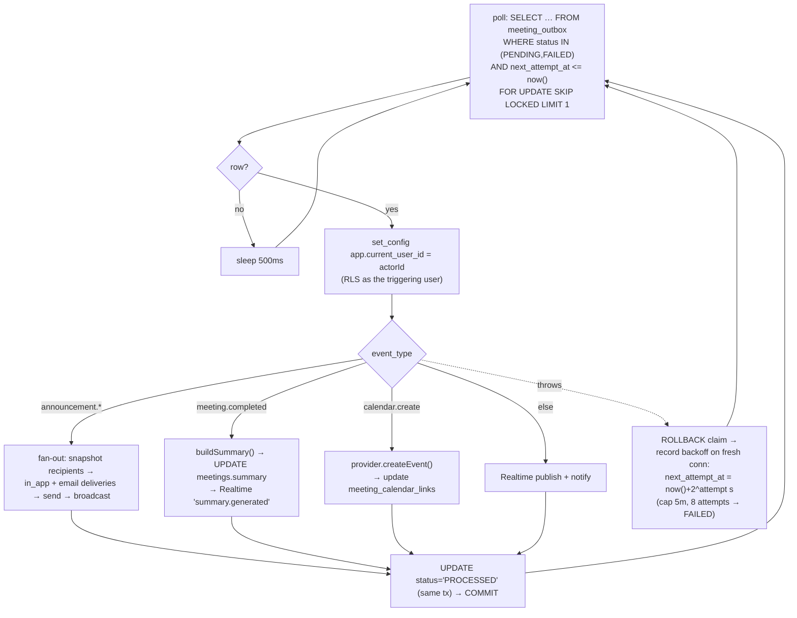

# HHCP Node Backend — Architecture (API + Worker)

The TypeScript port of the FastAPI backend, built per
[BACKEND-MIGRATION-ANALYSIS.md](BACKEND-MIGRATION-ANALYSIS.md). This document
describes the **runtime architecture** of the Node side: the NestJS API app, the
standalone outbox worker, how they share code, and how requests and events flow.

> One-line thesis: **the security model lives in PostgreSQL (RLS), so the Node
> tier is a faithful application-layer port.** Every request runs inside one
> transaction that sets `app.current_user_id` with `SET LOCAL`; RLS does the rest.

---

## 1. System topology



Four processes, one database:

| Process | Workspace | Port | Role |
|---|---|---|---|
| **Gateway** | `apps/gateway` | 8080 | Reverse proxy; routes each path-prefix to Python or Node (§9). HTTP **and** WebSocket upgrades. |
| **Node API** | `apps/backend-node` | 8001 | NestJS on Fastify. All 17 routers = 114 REST routes + `/health` + `WS /ws/meetings/:id`. |
| **Worker** | `apps/backend-node-worker` | — | Drains the transactional outbox out-of-request. Separate process. |
| **Python API** | `backend/` (unchanged) | 8000 | Reference implementation + rollback target. |

Both API backends connect to the **same** PostgreSQL with the **same**
non-superuser `hhcp_app` role, so RLS applies identically regardless of which one
answers — that's what makes them interchangeable behind the gateway.

---

## 2. The load-bearing idiom: RLS-scoped connections

Everything hinges on [`database.service.ts`](../apps/backend-node/src/database/database.service.ts).
It is the faithful port of Python's `get_scoped_connection()`.



Key properties:

- **One request = one transaction = one RLS scope.** `scoped(userId, fn)` opens a
  `postgres.js` transaction, runs `set_config('app.current_user_id', userId, true)`
  (`true` = `SET LOCAL`, transaction-scoped), then runs `fn` with that transaction
  handle. `SET LOCAL` can never leak onto the next request that reuses the pooled
  connection.
- **Default-deny.** If `userId` is `null`, nothing is set and RLS returns **zero
  rows** — never an error, never a leak.
- **`AsyncLocalStorage`** carries the active transaction handle through the call
  stack (`db.current`), so helpers deep in a request reach the same scoped
  connection without threading it through every signature.
- **`db.unscoped`** is the raw pool for identity lookups that are *not*
  tenant-scoped (e.g. mapping a Supabase `sub` → `users.id`, checking
  `is_active`).
- **Type parsers** (registered on the pool): `bigint`(OID 20)→JS `number` so
  `count(*)` serializes as a JSON number; `date`(OID 1082)→`'YYYY-MM-DD'` string
  so date columns match Pydantic's `date`, not a full ISO timestamp.

Application code **never writes `WHERE tenant_id = …`** for isolation — that is
RLS's job. (Business-scope filters like "only this tenant's open issues" still
appear, layered on top.)

---

## 3. Node API app structure

```
apps/backend-node/src/
  main.ts                 # bootstrap: Fastify adapter, cookies, rate-limit hook,
                          #   security-headers hook, CORS, ValidationPipe,
                          #   {detail} filter, WebSocket attach
  app.module.ts           # root module — imports every feature module
  config/                 # ConfigService (.env loader, setdefault semantics, demo defaults)
  database/               # DatabaseService (scoped/unscoped/current) — @Global
  auth/                   # AuthGuard, AuthController (7 routes), security.ts (HS256 JWT),
                          #   supabase-auth.ts (ES256/JWKS + HS256 local) — @Global
  common/                 # cross-cutting, framework-agnostic helpers (see §5)
  integrations/           # lucid.ts, calendar.ts, realtime-broadcast.ts
  realtime/               # MeetingRealtime — in-process WS room manager
  <feature>/<feature>.module.ts   # one file per router: controller + @Module
```

Feature modules (each a `@Controller` + `@Module` in one file, mirroring the 17
Python routers): `auth, organizations, users, teams, scorecards, rocks, issues,
meetings, seats, todos, directory, reports, audit, vcbs, federation, vision,
announcements`.

`DatabaseModule` and `AuthModule` are `@Global`, so any controller injects
`DatabaseService` and applies `@UseGuards(AuthGuard)` without re-importing.

### Request pipeline (main.ts)

Order matters:

1. **`@fastify/cookie`** — httpOnly cookie read/write.
2. **Rate limiter** (`onRequest` hook) — fixed-window 200/60s per IP.
3. **Security headers** (`onSend` hook) — nosniff / X-Frame DENY / Referrer-Policy / X-XSS-Protection.
4. **CORS** — localhost regex, `credentials: true`, exposes `X-RateLimit-*`, `Retry-After`, `X-Report-Engine`.
5. **`ValidationPipe`** — `class-validator` DTOs; `422` on failure (matches Pydantic).
6. **`DetailExceptionFilter`** — every error becomes `{ "detail": "..." }` (the shape the frontend reads).
7. **WebSocket attach** — `MeetingRealtime.attach(rawHttpServer)` before `listen`.

---

## 4. Authentication & authorization

Authorization stays in the database (**Option B**); only identity/session is
re-implemented.

- **Local provider** (`AUTH_PROVIDER=local`): HS256 JWT (`jsonwebtoken`), 15-min
  access / 14-day refresh; refresh tokens stored as **SHA-256 hashes** in
  `refresh_tokens`, revoked server-side. Claims: `user_id`, `active_tenant_id`.
- **Supabase provider** (`AUTH_PROVIDER=supabase`): `jose` verifies **ES256 via
  JWKS** (hosted) or **HS256 shared secret** (local CLI), enforcing
  `audience="authenticated"` + issuer; invite-only `supabase_uid` linking.
  See [Supabase support](#8-supabase).
- **Sessions:** httpOnly cookies (`access_token`, `refresh_token`,
  `sb_refresh_token`), `samesite=lax`; Bearer header fallback.
- **RBAC:** [`common/permissions.ts`](../apps/backend-node/src/common/permissions.ts) —
  the 11-role → `{view,create,edit,delete,provision}` matrix + `requirePermission`
  / `requireRowPermission` / `requireLeadership`, resolved on the scoped connection
  via the DB's `SECURITY DEFINER` functions (`user_role_for_tenant`, etc.).
- **Fund tiers:** [`common/fund-access.ts`](../apps/backend-node/src/common/fund-access.ts)
  (`requireFundAdmin` / `requireFundView`) for the RLS-free `users`/`audit_log` tables.

---

## 5. Shared helpers (`common/` + `integrations/`)

These encapsulate the cross-cutting concerns. Several are **framework-agnostic**
(read `process.env` at call time, no Nest imports) specifically so the worker can
reuse them.

| File | Purpose | Reused by worker? |
|---|---|---|
| `common/outbox.ts` | `emit(sql, type, {...})` — append an event on the request's transaction | — (write side only) |
| `common/idempotency.ts` | `lookup` / `save` — replay stored response; 409 on key reuse w/ different body | — |
| `common/sanitizer.ts` | `sanitizeHtml()` (announcement bodies) via `sanitize-html`, same allowlist | — |
| `common/meeting-summary.ts` | `buildSummary(sql, meetingId)` — deterministic post-meeting summary | ✅ |
| `common/mailer.ts` | `sendEmail()` via nodemailer (→ Mailpit in demo), best-effort | ✅ |
| `common/agendas.ts` | static L10 / quarterly / 1-on-1 templates | — |
| `common/rate-limit.ts` | fixed-window limiter (Fastify hook) | — |
| `common/audit.ts` | `auditLog()` → RLS-free `audit_log` | — |
| `integrations/realtime-broadcast.ts` | Supabase Realtime Broadcast (server-side `fetch`) | ✅ |
| `integrations/calendar.ts` | Google/MS provider scaffold (`getProvider`, `CalendarNotConfigured`) | ✅ |
| `integrations/lucid.ts` | Lucidchart OAuth → embed-session token | — |

`meeting-summary.ts` uses `import type { ScopedSql }` (erased at compile), so
importing it into the worker pulls in **no** Nest runtime.

---

## 6. The async backbone: transactional outbox + worker

This is the heart of "worker handling." The pattern guarantees a domain change
and its event either both commit or both roll back.

### 6.1 Write side (inside the API request)

Every state change that must fan out calls `emit(sql, eventType, {...})` **on the
same scoped transaction** as the domain write:

```ts
await this.db.scoped(user.user_id, async (sql) => {
  await sql`UPDATE meetings SET status='completed', ... WHERE id=${id}`;
  await emit(sql, 'meeting.completed', { aggregateId: id, tenantId, payload: {...} });
});   // ← both rows commit together, or neither does
```

The event lands in `meeting_outbox` with `status='PENDING'`. The API request
returns immediately; nothing slow happens on the request thread.

### 6.2 Read side (the worker) — `apps/backend-node-worker`



Design points (faithful port of `workers/outbox_worker.py`):

- **`FOR UPDATE SKIP LOCKED`** lets many workers run without double-processing.
- **Success path is one transaction:** claim + do the work + mark `PROCESSED`
  commit together, so a crash mid-work simply leaves the row claimable again.
- **On failure** the claim is rolled back and the error/backoff is recorded on a
  **fresh** connection (the claim tx is gone): `next_attempt_at = now() + 2^attempt`
  seconds, capped at 5 min, up to **8 attempts** → then `FAILED` permanently.
- **Stuck-row reaper** resets rows left `PROCESSING` by a crashed worker.
- **No superuser bypass:** for events that read tenant data, the worker sets
  `app.current_user_id` to the event's `actorId` (who by construction can see that
  tenant), so RLS still applies inside the worker.
- **Realtime is best-effort:** a failed Supabase broadcast never fails the outbox
  row — clients recover via the RLS-guarded REST feed / `/live-state`.

### 6.3 The 9+ event types

`calendar.create`, `meeting.started|paused|resumed|cancelled|completed`,
`segment.changed`, `segment.updated`, `agenda.reordered`, plus
`announcement.published|updated`. The announcement fan-out snapshots the audience
into `announcement_recipients`, writes `notification_deliveries` (in-app +
email), sends mail, and nudges live feeds.

### 6.4 Scheduled jobs stay in the DB

The three `pg_cron` jobs — including the per-minute `publish_due_announcements()`
— are **DB-resident and unchanged**. They are *not* reimplemented as app cron;
`publish_due_announcements()` emits into the same outbox the worker drains.

### 6.5 Running the worker

```bash
npm start -w @hhcp/backend-node-worker    # run_forever poll loop
npm run drain -w @hhcp/backend-node-worker # one-shot: drain all due events, print count
```

It runs via `tsx` (no build step) and reuses the framework-agnostic helpers from
`apps/backend-node/src` by relative import.

---

## 7. Realtime meeting rooms (WebSocket)

[`realtime/realtime.gateway.ts`](../apps/backend-node/src/realtime/realtime.gateway.ts)
is a faithful port of the Python in-process room manager, attached to the raw
Node HTTP server in `main.ts`.

- Endpoint `WS /ws/meetings/:id`; auth via the `access_token` cookie or `?token=`.
  Bad auth → close code **4401** (accept-then-close).
- In-memory `rooms: Map<meetingId, Map<ws, {userId, name}>>`; three message types:
  `presence` (dedup by user), `section` (facilitator drives everyone), `refetch`
  (a list changed).
- **Scale-out note:** in-process rooms need a Redis pub/sub adapter for multiple
  instances (documented gap). Server-authoritative broadcasts already go through
  Supabase Realtime from the worker (§6).

---

## 8. Supabase

- **Auth:** ES256/JWKS (hosted) or HS256 (local CLI) — [`auth/supabase-auth.ts`](../apps/backend-node/src/auth/supabase-auth.ts).
- **Realtime:** server-side broadcast from the worker — [`integrations/realtime-broadcast.ts`](../apps/backend-node/src/integrations/realtime-broadcast.ts).
- **Postgres:** point `DATABASE_URL` at Supabase-managed Postgres; same RLS applies.
- Config: `SUPABASE_URL`, `SUPABASE_ANON_KEY`, `SUPABASE_SERVICE_ROLE_KEY`,
  `SUPABASE_JWKS_URL`, `SUPABASE_JWT_SECRET`.

---

## 9. Reports (CPU-bound path)

[`reports/`](../apps/backend-node/src/reports) generates binary downloads:
`exceljs` (xlsx), Playwright headless Chromium (pdf/png) with a `pdfkit`
fallback, and the `X-Report-Engine` response header naming the engine used.

> ⚠️ Playwright/Chromium **blocks the event loop** in-process. The plan
> recommends isolating report generation into a dedicated service / worker
> threads for production; the `pdfkit` fallback keeps xlsx/scorecard-pdf working
> even without Chromium (`npx playwright install chromium` enables the full path).

---

## 10. Gateway (`BE_SERVER` / `NODE_ROUTES`)

[`apps/gateway/src/index.js`](../apps/gateway/src/index.js) proxies each request
(HTTP and WS upgrade) by path-prefix:

1. prefix in `NODE_ROUTES` → **Node**
2. else if `BE_SERVER=node` → **Node** (whole-app cutover)
3. else → **Python** (default owner)

Set these in `apps/gateway/.env`. Cookies work through the proxy because the
backends set them with `path=/` and no explicit domain, so the browser scopes
them to the gateway origin. Rollback = remove a prefix (or set `BE_SERVER=python`)
— config only, no redeploy.

---

## 11. Monorepo layout

```
hhcp/                       # npm workspaces
  apps/
    backend-node/           # NestJS API (this doc, §3)
    backend-node-worker/    # outbox worker (§6)
    gateway/                # BE_SERVER reverse proxy (§10)
  packages/
    db/                     # numbered .sql migrations (single source of truth) + seeds
    api-contract/           # api-types.d.ts — the REST contract
    shared-types/           # framework-agnostic enums/types
    contract-tests/         # golden-response parity harness (analysis §16)
  backend/                  # Python FastAPI (reference, unchanged)
  frontend/                 # Next.js (only NEXT_PUBLIC_API_BASE env-ized)
```

---

## 12. How to run the whole stack (local demo)

```bash
# 0. DB + schema (see packages/db/README.md) and seed data
# 1. deps
npm install

# 2. build the Node API
npm run build -w @hhcp/backend-node

# 3. processes (separate terminals)
#    Python reference:
cd backend && venv/bin/uvicorn app.main:app --port 8000
#    Node API:
npm start -w @hhcp/backend-node           # :8001
#    Worker:
npm start -w @hhcp/backend-node-worker
#    Gateway:
npm start -w @hhcp/gateway                # :8080  (BE_SERVER in apps/gateway/.env)

# 4. point the frontend at the gateway
#    frontend/.env.local:  NEXT_PUBLIC_API_BASE=http://localhost:8080
```

Verify parity once both API backends are up on the same seeded DB:

```bash
npm test -w @hhcp/contract-tests
```

---

## 13. Environment variables (Node API)

| Var | Default | Notes |
|---|---|---|
| `DATABASE_URL` | local demo | same DB + `hhcp_app` role as Python |
| `AUTH_PROVIDER` | `local` | `local` \| `supabase` |
| `JWT_SECRET` | demo | HS256 local auth |
| `PORT` | `8001` | |
| `SUPABASE_URL/ANON_KEY/SERVICE_ROLE_KEY/JWKS_URL/JWT_SECRET` | unset | §8 |
| `LUCID_CLIENT_ID/SECRET/REFRESH_TOKEN/API_VERSION/EMBED_ORIGIN` | unset / demo | seats embeds |
| `SMTP_HOST/PORT/FROM` | Mailpit | announcement email |
| `GOOGLE_CALENDAR_* / MS_CALENDAR_*` | unset | calendar scaffold |
| `RATE_LIMIT` / `RATE_LIMIT_WINDOW` | `200` / `60` | fixed-window limiter |

Gateway: `BE_SERVER`, `NODE_ROUTES`, `PYTHON_TARGET`, `NODE_TARGET`,
`GATEWAY_PORT`. Worker: `DATABASE_URL`, `SUPABASE_*`, `SMTP_*`,
`LUCID_EMBED_ORIGIN`, `*_CALENDAR_*`.

---

## 14. Technology stack & package usage

TypeScript strict everywhere; Node 20; npm workspaces. No ORM (raw SQL via
`postgres.js`) — deliberate, because the RLS `SET LOCAL` idiom and the advanced
Postgres features (partitioning, `pg_cron`, generated `tsvector`, `SECURITY
DEFINER` functions) have no ORM representation.

### 14.1 `apps/backend-node` (NestJS API)

| Package | Ver | Used for | Replaces (Python) |
|---|---|---|---|
| `@nestjs/core`, `@nestjs/common` | ^10.4 | DI, modules, guards, pipes, filters | FastAPI app + `Depends` |
| `@nestjs/platform-fastify` | ^10.4 | HTTP server (Fastify adapter) | uvicorn/Starlette |
| `@fastify/cookie` | ^9.4 | httpOnly cookie read/write | Starlette cookies |
| `postgres` (postgres.js) | ^3.4 | raw-SQL driver, pooling, `SET LOCAL` transaction scope, type parsers | `asyncpg` |
| `jsonwebtoken` | ^9.0 | local HS256 JWT issue/verify | `PyJWT` |
| `jose` | ^5.9 | Supabase ES256/JWKS + HS256 verify, `createRemoteJWKSet` | `PyJWT` + JWKS client |
| `bcryptjs` | ^2.4 | password hashing (`$2b$` hashes port unchanged) | `bcrypt` |
| `class-validator` + `class-transformer` | ^0.14 / ^0.5 | DTO validation/transform (`ValidationPipe`) | Pydantic |
| `sanitize-html` | ^2.17 | announcement HTML allowlist sanitizer | stdlib `html.parser` sanitizer |
| `exceljs` | ^4.4 | xlsx report generation | `openpyxl` |
| `playwright` | ^1.62 | headless-Chromium HTML→PDF/PNG | Playwright (Python) |
| `pdfkit` | ^0.19 | pure-JS PDF fallback engine | `fpdf2` |
| `nodemailer` | ^9.0 | SMTP email (→ Mailpit) | `smtplib` |
| `ws` | ^8.21 | meeting-room WebSocket server | Starlette WebSocket |
| `reflect-metadata` | ^0.2 | decorator metadata (Nest requirement) | — |
| `rxjs` | ^7.8 | Nest peer dependency | — |
| global `fetch` / `AbortSignal.timeout` | Node 20 | Supabase refresh, Realtime, Lucid OAuth | `httpx` / `urllib` |
| `crypto` (stdlib) | Node 20 | SHA-256 refresh-token + idempotency body hashing | `hashlib` |
| `async_hooks` `AsyncLocalStorage` (stdlib) | Node 20 | carry the scoped tx through the request | contextvars / conn passing |
| **dev:** `@nestjs/cli`, `@nestjs/schematics`, `typescript` ^5.6, `@types/*` | | build + types | — |

### 14.2 `apps/backend-node-worker` (outbox worker)

| Package | Ver | Used for |
|---|---|---|
| `postgres` | ^3.4 | own pool; `FOR UPDATE SKIP LOCKED` claim loop |
| `nodemailer` | ^9.0 | announcement email fan-out (dep of the reused `mailer.ts`) |
| **dev:** `tsx` | ^4.19 | run TS directly (no build step); resolves the shared helpers imported from `apps/backend-node/src` |
| **dev:** `typescript`, `@types/node` | | typecheck |

Reuses (by relative import, framework-agnostic) `meeting-summary.ts`,
`mailer.ts`, `realtime-broadcast.ts`, `calendar.ts` from the API app.

### 14.3 `apps/gateway`

| Package | Ver | Used for |
|---|---|---|
| `http-proxy` | ^1.18 | HTTP + WebSocket-upgrade reverse proxy; `changeOrigin`, `xfwd` |
| Node `http` (stdlib) | 20 | the listening server + `upgrade` event routing |

Plain JavaScript (no build); the whole gateway is one ~110-line file.

### 14.4 `packages/*`

| Package | Deps | Used for |
|---|---|---|
| `contract-tests` | dev: `tsx`, `typescript`, `@types/node` | golden-response parity harness; uses global `fetch` + `Headers.getSetCookie()` — zero runtime deps |
| `shared-types` | dev: `typescript` | framework-agnostic enums/types; emits `.d.ts` |
| `db` | — | numbered `.sql` migrations + Python seed scripts (applied via `psql`) |
| `api-contract` | — | `api-types.d.ts` (the REST contract) |

### 14.5 External services / tooling

- **PostgreSQL** — the system of record and the security model (RLS, `SECURITY
  DEFINER` functions, declarative partitioning + `pg_partman` + `pg_cron`, BRIN,
  generated `tsvector` + GIN/`pg_trgm`). Unchanged from the Python stack.
- **Supabase** — Auth (JWKS/JWT) and Realtime Broadcast; optionally the managed
  Postgres host.
- **Mailpit** (demo SMTP catcher) — viewable email at `:54324`.
- **Chromium** — installed on demand via `npx playwright install chromium` for the
  full PDF/PNG report path (otherwise `pdfkit` fallback).

---

## 15. Verification status

- `tsc` strict + `nest build` clean across all TS workspaces.
- All 114 REST routes + `/health` + the WebSocket map 1:1 with the Python routers.
- Security headers, CORS, rate limiting, `{detail}` errors verified live.
- Behavioral parity (meeting concurrency, outbox fan-out, 3-RED auto-issue) is a
  **faithful port**; run [`packages/contract-tests`](../packages/contract-tests)
  against both backends on one seeded DB to prove it body-for-body.
